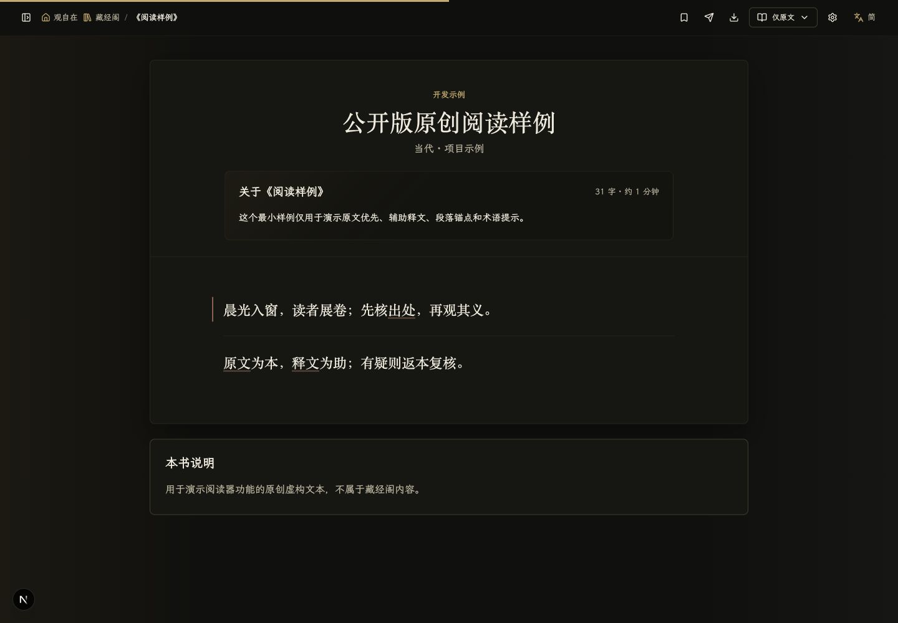

# 观自在 Guanzizai

[](https://github.com/AmigaMeow/guanzizai)

观自在是一个面向佛教典籍与古籍的现代阅读项目。我们希望把安静、清楚的阅读体验与可靠的数字工具结合起来，让读者能够从原文出发，在需要时获得释文、检索和出处辅助。

项目当前以 Next.js、React 和 TypeScript 构建，覆盖从内容导入、整理和审核，到前台阅读、个人书房和引用式问答的完整流程。



如果这个项目对你有帮助，欢迎点击仓库右上角的 `Star`；也欢迎分享给需要典籍阅读工具的朋友。

## 项目理念

- **原文优先**：原文是阅读和引用的依据，白话释文只作辅助，不替代原文。
- **出处可核验**：检索和问答尽量返回具体段落与阅读位置，避免把一般知识伪装成经典原文。
- **内容有边界**：区分真人审核、待复核和 AI 辅助内容，让读者知道文本可靠到什么程度。
- **适合长期阅读**：兼顾桌面与移动设备，提供安静、克制并保留东方留白的阅读体验。
- **鼓励免费传播**：支持个人学习、教学、公益传播和非商业推广，让典籍知识更容易被接触。

## 主要能力

- 原文、释文和平行对照阅读模式；
- 分卷目录、段落定位、站内搜索和阅读导出；
- 书架、收藏、划线、阅读进度与账户功能；
- 基于已发布内容检索的问答与出处卡片；
- 译文生成、质量检查、投稿和人工审核流程；
- 内容版本、来源核验、数据库迁移与对象存储支持；
- 面向维护者的内容管理、模型设置和运营后台。

## 公开版本

本仓库是经过脱敏的源码版本，只附带少量原创虚构文本用于演示。生产站点的藏经阁书籍、真实译文、预生成回答、数据库、用户数据、支付信息和密钥均不在仓库中。

自行部署时，请只导入自己拥有版权、已经取得授权，或经当地法律确认可以使用的内容。本项目不主张对依法属于公有领域的佛教经典本身享有独占权。

## 项目结构

- `apps/web`：当前主线，Next.js / React / TypeScript。
- `scripts`：内容导入、审核、迁移和工程辅助脚本。
- `postgres`、`migrations`：数据库结构与迁移。
- `test`：自动化测试。

生产环境校验脚本 `scripts/verify-production-env.mjs` 是部署安全闸门，不应删除或绕过。

## 本地运行

需要 Node.js、pnpm 9 和 PostgreSQL（仅数据库功能需要）。

```bash
pnpm install
pnpm run dev:next
```

默认开发地址由 Next.js 输出，通常为 `http://localhost:3000`。

验证：

```bash
pnpm run typecheck
pnpm test
pnpm run build:next
```

复制 `.env.example` 中需要的变量到未提交的本地环境文件。不要把真实密钥、数据库地址或生产数据提交到仓库。

数据库初始化、环境变量、OAuth 回调及 Vercel / Cloudflare 部署步骤见 [搭建与部署指南](docs/SETUP.md)。

## 使用许可

个人学习、研究、教学、公益传播和其他非商业使用可依 [LICENSE](LICENSE) 使用。基于本项目收费、营利或开展商业服务前，请联系 `admin@guanzizai.org` 取得书面授权；复制、修改或分发时请保留原仓库声明。

详细规则见 [COMMERCIAL-LICENSE.md](COMMERCIAL-LICENSE.md)、[CONTENT-LICENSE.md](CONTENT-LICENSE.md)、[NOTICE](NOTICE) 和 [TRADEMARKS.md](TRADEMARKS.md)。

## 贡献与安全

提交代码前请阅读 [CONTRIBUTING.md](CONTRIBUTING.md)。安全问题请按 [SECURITY.md](SECURITY.md) 私下报告，不要在公开 Issue 中披露凭据或可利用细节。

## 第三方材料

第三方依赖继续适用各自许可证。字体 `guanzizai-cjk-ext-fallback.woff2` 及其修改说明适用随附的 `apps/web/public/fonts/ARPHICPL.txt` 和 `apps/web/public/fonts/NOTICE-Guanzizai-CJK-Extension-Fallback.txt`，该第三方字体许可优先于本仓库的软件许可。

Required Notice: Copyright 2026 AmigaMeow. Guanzizai source repository: https://github.com/AmigaMeow/guanzizai
